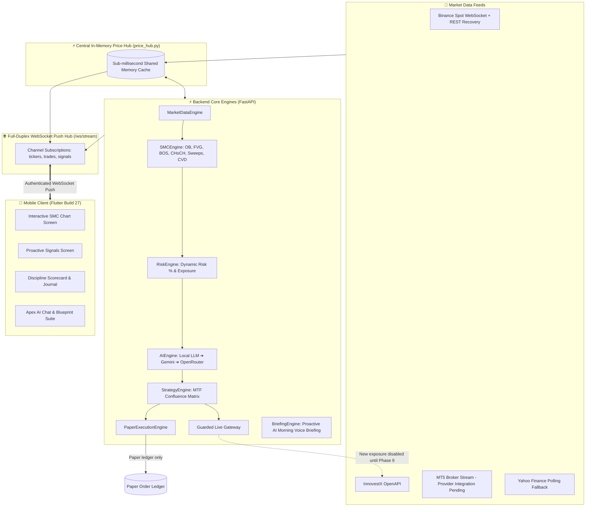

# 🦅 AI Trade Advisor (Apex AI)
### Institutional-Grade Smart Money Concepts (SMC) & Multi-Provider AI Trading Suite

[](https://fastapi.tiangolo.com)
[](https://flutter.dev)
[](https://www.docker.com)
[](https://opensource.org/licenses/MIT)

An advanced, full-stack trading intelligence platform designed for Crypto, Forex, Gold, and Thai/Global Equities. It combines a deterministic three-indicator decision core—**SMC Structure**, **Volume Delta/CVD**, and **Squeeze Momentum**—with adaptive market-regime policy, multi-provider AI analysis, isolated Paper execution, and a guarded Live gateway. Binance Spot market data and backend-to-client updates use WebSocket push; Forex, Gold and equities remain explicitly labelled polling fallbacks until a broker-native stream is configured.

> 📚 **Detailed User Guide Available**: See [`USER_MANUAL.md`](file:///c:/Users/arthit.n/git/ai_trade_advisor/USER_MANUAL.md) for full screen-by-screen walkthroughs, indicator interpretations, and risk management guidelines in Thai.

> 🛡️ **Current hardening roadmap**: [Phase 0 — Paper/Live Boundary](PHASE_0_PAPER_LIVE_BOUNDARY.md) ✅ · [Phase 1 — Indicator Decision Core](PHASE_1_INDICATOR_DECISION_CORE.md) ✅ · [Phase 2 — Market Regime & Adaptive Policy](PHASE_2_MARKET_REGIME_POLICY.md) ✅ · [Phase 3 — Evidence, Replay & Backtesting](PHASE_3_EVIDENCE_REPLAY_BACKTEST.md) 🧪 · [Phase 4 — True Real-Time Data](PHASE_4_TRUE_REALTIME_DATA.md) ✅ · [Phase 5 — Ordered MTF Hierarchy](PHASE_5_MTF_HIERARCHY.md) 🧪 · [Phase 6 — Paper OMS](PHASE_6_PAPER_OMS.md) ✅

## 🗺️ Production Hardening Roadmap

The hardening phases below supersede the older build-number feature milestones. “Completed” means the documented safety/core milestone is implemented; it does not mean the strategy is proven profitable or that Live order placement is enabled.

| Phase | Scope | Status |
| :---: | :--- | :---: |
| 0 | Strict Paper/Live boundary, ephemeral Live Session, fail-closed Live gateway and kill switch | ✅ Complete |
| 1 | Modular, explainable and configurable three-indicator decision core | ✅ Complete |
| 2 | Market-regime classifier and deterministic adaptive entry/risk policy | ✅ Complete |
| 3 | PostgreSQL evidence/ledger records, batch replay, execution-aware OOS backtesting and deterministic release gates | 🚧 Core implemented; validation in progress |
| 4 | Binance WebSocket market data, true aggressor-trade CVD, sequence-gap recovery and freshness monitoring | ✅ Core deployed and runtime validated |
| 5 | Ordered 4H Bias → 1H Setup → 15m Trigger profiles, shared closed-candle matrix, replay and MTF backtest parity | 🧪 Core implemented; parameter/Paper validation in progress |
| 6 | Production-grade Paper OMS: partial fills, partial TP, fees, slippage and restart recovery | ✅ Complete and deployed |
| 7 | Verified global-news intelligence and deterministic News Risk Gate, Paper first | ⏳ Planned |
| 8 | Portfolio risk: aggregate exposure, correlation clusters, drawdown locks and margin buffers | ⏳ Planned |
| 9 | Single-broker Live OMS, reconciliation, protective broker orders, shadow mode and canary rollout | 🔒 Blocked by evidence/safety gates |
| 10 | AI post-trade review, Thai briefing and governed continuous improvement | ⏳ Planned |

Phase 3 strategy validation continues while the Phase 4 Binance pipeline is operational. Strategy changes must pass replay, out-of-sample evaluation and Paper validation before they can become a versioned production release. AI cannot enable Live mode, override the Risk Engine, or promote parameters directly to production.

Phase 3 mirrors isolated execution snapshots into normalized PostgreSQL
`trade_ledger_records`, `order_ledger_records` and append-only
`fill_ledger_records` for analysis/replay. Phase 6 now makes the dedicated
PostgreSQL Paper OMS authoritative for account, position, order, fill and
transition state. `paper_trades_store.json` is a compatibility projection only;
production fails closed if the OMS is unavailable. The deployed restart test
recovered the same open state with no duplicate import.

Chart Overlay and Proactive Scanner now consume the same canonical Phase 5
decision: 4H Market Bias, 1H SMC Setup and 15m Entry Trigger, completed candles
only, role-specific profiles and one composite `snapshot_id`. These are ordered
gates rather than averaged scores, so a 15m trigger cannot bypass an opposite
4H/1H structure.

Long/Short parity is a system invariant for every supported market, especially
Forex: Long is buy-to-open/sell-to-close, while Short is
sell-to-open/buy-to-cover. Order intent must explicitly distinguish opening a
Short from reducing a Long, and future Live broker adapters must fail closed
when position-side or reduce-only behavior is ambiguous.

---

## 🏛️ Current System Architecture



---

## 💎 Existing Product Features

The headings in this section are legacy feature milestones and are not the production-hardening phase numbers above. Some features remain prototypes until their corresponding hardening phase passes its evidence criteria.

### 🎯 Phase 1: Smart Execution & Dynamic Risk Suite (Build 24 ✅)
* **Dynamic Risk Position Sizer**: Automatically calculates exact units/lots based on percentage account risk (0.5%, 1.0%, 2.0%, 3.0%) and physical distance between Entry and Stop Loss:
  $$\text{Position Size} = \frac{\text{Account Capital} \times \text{Risk \%}}{\left|\text{Entry} - \text{Stop Loss}\right|}$$
* **Auto-Breakeven (Auto-BE)**: At $+1.0\text{R}$ the event-driven Paper OMS moves Stop Loss beyond nominal entry far enough to cover modeled fees and exit slippage. Market gaps can still exceed the model.
* **Multi-Tier Trailing Stop**: At $+1.5\text{R}$ lock $+0.6\text{R}$, at $+2.0\text{R}$ lock $+1.2\text{R}$, and from $+2.5\text{R}$ trail the favorable extreme by $0.8\text{R}$ for both Long and Short.

---

### 📊 Feature Milestone: Signal & Confluence Edge — MTF Alignment Matrix (Build 25, hardened in Phase 5)
* **Ordered Multi-Timeframe authority**: `4H Bias → 1H Setup → 15m Trigger` is shared by Chart, Scanner, evidence replay and MTF-aware OOS backtesting. Optional 1D macro context and regime hysteresis remain future evidence-driven extensions.
* **Institutional Grade Badging**:
  * `🌟 SUPREME GRADE A+` (4/4 TF Aligned — Highest Probability)
  * `💎 GRADE A` (3/4 TF Aligned)
  * `⚖️ GRADE B` (2/4 TF Aligned)
  * `⏳ WAIT / CONFLICTED` (< 2/4 Aligned — Cash Preservation)
* **Volume Delta & Cumulative Volume Delta (CVD) Absorption**: Detects institutional limit order absorption and liquidity exhaustion (`🐳 CVD Absorption`).

---

### 🧠 Feature Milestone: Cognitive Loop & Post-Trade Intelligence (Build 26, partial)
* **Discipline Scorecard (0–100)**: Quantitative behavioral score calculated from Plan Adherence % and Average Star Ratings (⭐⭐⭐⭐⭐):
  $$\text{Discipline Score} = \operatorname{clamp}((\text{Plan Adherence \%} \times 0.6) + (\text{Avg Star Rating} \times 8.0), 0, 100)$$
* **Rule-based trade audit**: Generates transparent post-trade breakdowns. Evidence-backed AI review using MFE/MAE is planned for Phase 10.
* **Interactive AI Audit Modal Sheet**: Bottom sheet with star ratings, parameter tables, and `🔄 Re-Audit Trade with AI` button.

---

### ⚡ Feature Milestone: Push Infrastructure & Voice Intelligence (Build 27, partial)
* **Full-Duplex WebSocket Push Hub (`/ws/stream`)**: Authenticated channel push for prices, trades and signals with heartbeat and reconnect support.
* **Central In-Memory Price Hub (`price_hub.py`)**: Event-driven shared process-local quote, freshness, closed-candle and aggressor-CVD cache. Binance Spot uses WebSocket; other markets are visibly labelled fallbacks.
* **Proactive AI Daily Voice Briefing (`/api/v1/briefing/morning`)**: Institutional morning voice script and audio speech synthesis in Thai summarizing Market Regime, Key SMC Levels, and Focus Setups.

---

## 📊 Complete Indicator & SMC Structure Suite

| Indicator / SMC Structure | Visual Representation | Quantitative Rule & Interpretation |
| :--- | :---: | :--- |
| **Bullish Order Block (OB)** | 🟢 Green Zone Box | Last bearish candle before aggressive expansion. Acts as high-probability demand zone. |
| **Bearish Order Block (OB)** | 🔴 Red Zone Box | Last bullish candle before aggressive selloff. Acts as institutional supply zone. |
| **Fair Value Gap (FVG)** | 🟣 Purple Imbalance | 3-candle price imbalance. Price tends to retrace and fill before trend continuation. |
| **Break of Structure (BOS)** | 📈 Solid Break Line | Candle body closing beyond previous swing high/low confirming trend continuation. |
| **Change of Character (CHoCH)**| 🔄 Reversal Tag | First structural break in opposite direction signaling potential trend reversal. |
| **Equilibrium 50% (EQ)** | ⚖️ Yellow Dashed Line| Dynamic 50% range midpoint. Longs strictly in Discount (<50%), Shorts in Premium (>50%). |
| **Liquidity Sweep (EQH/EQL)** | 🧹 Sweep Marker | High/Low wick penetration hunting retail stop losses followed by immediate rejection. |
| **CVD Volume Absorption** | 🐳 Absorption Badge | Price making lower lows while Cumulative Volume Delta rises (limit buy absorption). |
| **Multi-Timeframe Matrix** | 📊 Ordered 3-Role Gate | 4H authorizes direction, 1H validates setup and 15m confirms execution; upstream conflicts fail closed. |

---

## 📸 Screenshots & Verification (Build 27)

| Feature | Screenshot |
| :--- | :--- |
| **AI Daily Voice Briefing** |  |
| **Full-Duplex WS Chart** |  |
| **Real-time Signals Screen** |  |
| **Live Journal & Scorecard** |  |

---

## 🚀 Quick Start

### 1. Backend Setup
```bash
cd backend
python -m venv .venv
source .venv/bin/activate  # Windows: .venv\Scripts\activate
pip install -r requirements.txt
cp .env.example .env
uvicorn app.main:app --reload --host 0.0.0.0 --port 8000
```

### 2. Docker Deployment
```bash
cd backend
docker compose up -d --build
```

### 3. Mobile Setup (Flutter)
```bash
cd mobile
flutter pub get
flutter run
# Build Release APK
flutter build apk --release
```

---

## 📡 Key API Endpoints Reference

| Method | Path | Description |
| :--- | :--- | :--- |
| `WS` | `/ws/stream` | Full-Duplex real-time streaming hub (tickers, trades, signals) |
| `GET` | `/api/v1/briefing/morning` | Proactive daily voice briefing script and focus setups in Thai |
| `POST` | `/api/v1/signals/analyse` | Run deterministic signal, strategy and risk analysis and record Phase 3 evidence |
| `GET` | `/api/v1/signals/mtf-matrix` | Read the canonical ordered 4H/1H/15m decision matrix |
| `GET/PUT` | `/api/v1/settings/timeframe-profiles` | Read or atomically update validated Phase 5 role profiles |
| `GET` | `/api/v1/evidence/events` | Query immutable decision-evidence events |
| `POST` | `/api/v1/evidence/events/{id}/replay` | Replay a recorded decision with its original data and configuration |
| `POST` | `/api/v1/evidence/batch-replay` | Replay up to 500 immutable decisions and persist reproducibility metrics |
| `GET` | `/api/v1/backtests/ledger/status` | Inspect JSON migration and normalized PostgreSQL trade/order/fill counts |
| `POST` | `/api/v1/backtests/runs` | Run and persist an execution-aware out-of-sample backtest |
| `GET` | `/api/v1/backtests/runs/{id}` | Read immutable metrics, simulated fills and Release Gate result |
| `POST` | `/api/v1/backtests/runs/{id}/release-gate` | Re-evaluate deterministic thresholds without promoting Production |
| `GET` | `/api/v1/market-data/status` | Inspect Phase 4 provider connectivity, freshness, gaps and CVD integrity |
| `GET` | `/api/v1/market-data/order-flow` | Read live aggressor CVD and closed-candle volume delta |
| `GET` | `/api/v1/journal/scorecard` | Discipline Score (0–100), plan adherence %, and win rate |
| `POST` | `/api/v1/journal/entries/{id}/ai-review` | On-demand AI cognitive trade re-audit |
| `POST` | `/api/v1/paper/orders` | Place an isolated Paper order |
| `POST` | `/api/v1/paper/orders/{id}/close`| Close an active Paper trade |
| `POST` | `/api/v1/live/session` | Explicitly open a short-lived guarded Live Session |
| `POST` | `/api/v1/live/orders/innovestx` | Canonical Live route; new exposure remains disabled until protective OMS is ready |
| `GET` | `/api/v1/chart/ohlcv` | Historical candlestick data across Crypto, Forex, Stocks |
| `GET` | `/api/v1/chart/overlay` | Quantitative SMC overlays (OB, FVG, BOS, CHoCH, EQ) |

---

## 📄 License
This project is licensed under the MIT License — see the [LICENSE](LICENSE) file for details.
