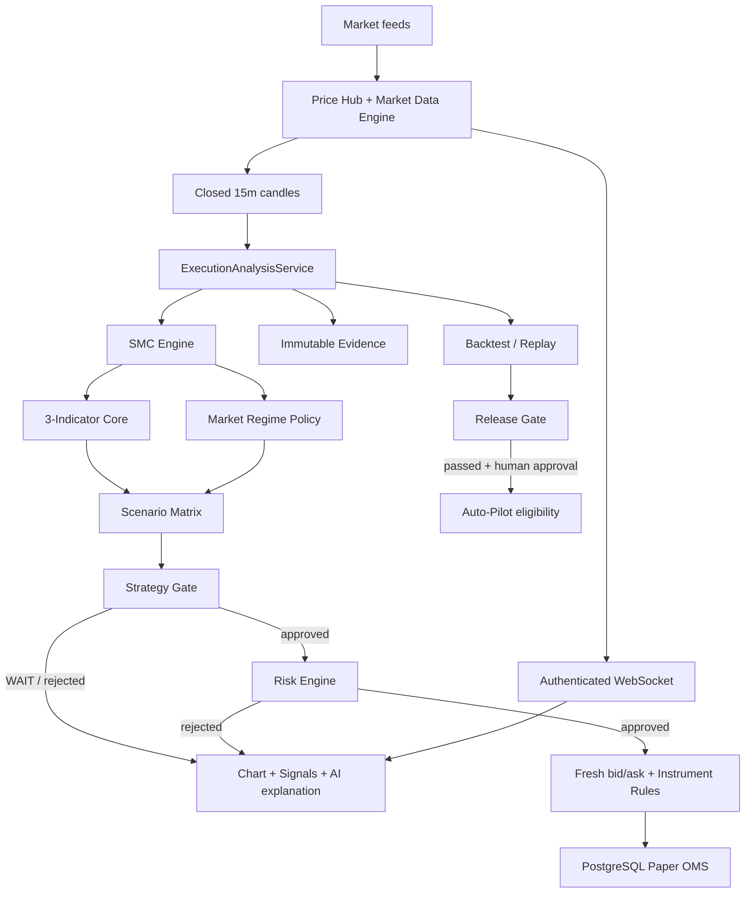

# AI Trade Advisor — Apex AI

ระบบวิเคราะห์และจำลองการเทรดแบบ full-stack สำหรับ Crypto, Forex, Gold และหุ้น พัฒนาด้วย FastAPI, Flutter, PostgreSQL, Redis และ Docker โดยใช้ Smart Money Concepts (SMC), Volume Delta/CVD และ Squeeze Momentum เป็นแกนตัดสินใจแบบ deterministic พร้อม Scenario Engine, Risk Engine, Paper OMS, AI Advisor, Evidence Replay และ Backtest Release Gate

> สถานะล่าสุด: ระบบตัดสินใจใช้เฉพาะแท่งปิดของ **Execution Timeframe 15 นาที** (`execution_timeframe_only`) เท่านั้น ข้อมูล MTF/HTF ห้ามนำมาคำนวณคะแนน ยืนยัน setup กำหนดขนาดสถานะ หรือออกคำแนะนำเทรด

> ระบบนี้เป็นเครื่องมือวิเคราะห์และ Paper Trading ไม่รับประกันผลกำไร Auto-Pilot ปิดเป็นค่าเริ่มต้น และ Live Trading ยังถูกป้องกันด้วย safety gate

## Technology Stack

| Layer | Technology |
| --- | --- |
| Client | Flutter 3 / Dart, Riverpod, Dio, GoRouter, WebSocket |
| API | Python 3.12, FastAPI, Pydantic, SQLAlchemy Async |
| Data | PostgreSQL 16, Redis 7, SQLite สำหรับประวัติแชต |
| Market data | Binance WebSocket + REST recovery, CCXT, Yahoo Finance/ผู้ให้บริการ fallback |
| AI | Ollama/LM Studio/OpenAI-compatible → Gemini → OpenRouter |
| Deployment | Docker Compose, Nginx, Android APK/Web build |

## Features ล่าสุด

### Chart และ Market Intelligence

- กราฟแท่งเทียนพร้อมราคาสดและข้อมูล OHLCV
- Clean SMC overlay: Order Block, FVG, BOS, CHoCH, EQ 50%, Equal High/Low, Swing High/Low และ Liquidity Sweep
- แสดง Market Regime, คะแนน 3-Indicator Core, Strategy Gate, Scenario และ Execution Blueprint
- หน้า Chart มี Apex AI Chat, AI Blueprint และรายการ Position
- รองรับ watchlist แยก Crypto, Forex/Gold และ Stocks
- Binance ใช้ WebSocket และมี sequence-gap recovery/freshness monitoring
- ตลาดที่ยังไม่มี broker-native stream ถูกระบุเป็น polling fallback อย่างชัดเจน

### Deterministic Trading Intelligence

- Canonical decision pipeline เดียวกันสำหรับ Chart, Signals, Scanner และ Backtest
- วิเคราะห์เฉพาะแท่ง 15 นาทีที่ปิดแล้ว ป้องกัน repaint จากแท่งที่ยังวิ่ง
- 3-Indicator Core ที่อธิบายคะแนนและ evidence ได้
- Market Regime เป็น policy gate ไม่ใช่ indicator ตัวที่สี่และไม่เพิ่มคะแนนซ้ำ
- Scenario Matrix จัดกลุ่มสถานการณ์ตาม causal trigger แบบเรียงลำดับความสำคัญ
- Strategy Gate ปฏิเสธ setup ที่ observation-only, ข้อมูลไม่พร้อม, R:R ไม่ถึง หรือผิด policy
- TP ต้องมาจาก liquidity/structure จริง ระบบไม่สร้างเป้า 2R/3R เพื่อทำให้ setup ดูผ่าน

### Risk และ Execution

- คำนวณ position size จาก risk budget และระยะ Entry–SL แบบรวมค่าธรรมเนียม spread และ slippage
- ตรวจ daily loss, drawdown, จำนวน position, correlated asset cluster, leverage และ quantity step
- ตรวจ tick size, lot size และ minimum notional ตาม instrument/exchange
- PostgreSQL Paper OMS เป็น source of truth สำหรับ Order, Position, Fill และ Event
- รองรับ market/limit order, partial fill, partial TP, Auto-BE, trailing stop, fee/slippage model และ restart recovery
- Auto-Pilot ต้องใช้ราคาสดที่ executable และ `approved RiskAssessment`; ข้อมูล stale หรือ metadata ไม่ครบจะ fail closed
- Live mode ใช้ short-lived session, kill switch และ guarded gateway; AI ไม่สามารถเปิด Live หรือข้าม Risk Engine ได้

### AI, Journal และ Evidence

- Apex AI Chat ใช้บริบทจาก execution timeframe และ Strategy Gate
- AI อธิบายตลาดได้ แต่ไม่มีสิทธิ์อนุมัติคำสั่งแทน deterministic engines
- AI ปฏิเสธการใช้ MTF/HTF เพื่อคำนวณหรือยืนยันคำแนะนำ
- Provider fallback: Local/Ollama/LM Studio → Gemini → OpenRouter
- Ollama native adapter รองรับโมเดล reasoning และ output budget 2,048 tokens เพื่อป้องกันประโยคถูกตัด
- ประวัติแชตแยก session และจัดเก็บใน SQLite
- Trading Journal, discipline scorecard และ rule-based post-trade review
- Immutable decision evidence, deduplication, single-event replay และ batch replay
- Execution-aware anchored out-of-sample backtest และ deterministic release gate

## System Architecture



## Canonical System Flow

1. `PriceHub` รับราคาและ trade stream พร้อมตรวจ freshness และ sequence gap
2. `MarketDataEngine` สร้าง OHLCV และส่งเฉพาะแท่ง 15 นาทีที่ปิดแล้ว
3. `ExecutionAnalysisService` snapshot ข้อมูลและ config พร้อมสร้าง `snapshot_id`
4. `SMCEngine` หาโครงสร้าง Swing/Internal, BOS, CHoCH, OB, FVG, EQ และ liquidity
5. `IndicatorCore` ประเมิน SMC Structure, Volume Delta/CVD และ Squeeze Momentum
6. `RegimeEngine` จำแนก Trending, Ranging, Volatile, Compression หรือ Unknown จาก price path/volatility โดยไม่ใช้คะแนน SMC ซ้ำ
7. `ScenarioMatrixEngine` เลือก Primary Scenario ตาม priority และสร้าง structural Entry/SL/TP เฉพาะเมื่อมีหลักฐานครบ พร้อมคำนวณ Support/Resistance Reaction เป็น secondary observation อิสระซึ่งไม่ถูก Primary Scenario บัง
8. `StrategyEngine` ตรวจ actionable status, readiness, confluence, regime policy, direction, zone, OB และ achievable R:R
9. หากไม่ผ่าน ระบบคืน `WAIT` พร้อม rejection reasons; AI และ Auto-Pilot ห้ามเปลี่ยนผลนี้
10. หากผ่าน `RiskEngine` ตรวจ portfolio guardrails และคำนวณขนาดสถานะจาก all-in risk
11. ก่อนส่งคำสั่ง ระบบตรวจ bid/ask สด, cooldown และ exchange instrument rules
12. `PaperOMS` จำลอง fill, fee, spread, slippage, SL/TP, Auto-BE และ trailing แบบ transactional
13. Evidence, order, fill และ transition ถูกจัดเก็บเพื่อ replay, backtest และ audit

Chart, Signals, Scanner และ Backtest เรียก pure decision function เดียวกัน (`analyze_execution_frame`) เพื่อลดความคลาดเคลื่อนระหว่างผลย้อนหลังกับ runtime

## Decision Logic

### 1. Execution timeframe authority

- Timeframe ที่ใช้ตัดสินใจ: `15m`
- ใช้ completed candle เท่านั้น
- Live quote ใช้แสดงราคาและจำลอง execution ไม่ถูกนำไปเพิ่มเป็นแท่งวิเคราะห์ที่ยังไม่ปิด
- `htf_bias` ถูกตั้งเป็น neutral ใน canonical execution path
- endpoint MTF เดิมมีไว้สำหรับ research/compatibility เท่านั้น
- MTF ห้ามมีส่วนใน confluence, Strategy Gate, RiskAssessment, position sizing, Auto-Pilot และ AI trade advice

### 2. Three-Indicator Core

Execution profile ปัจจุบันให้น้ำหนัก:

| Layer | Weight | หน้าที่ |
| --- | ---: | --- |
| SMC Structure | 35 | Structure direction, BOS/CHoCH, zone, OB/FVG และ liquidity event |
| Volume Delta/CVD | 30 | Buyer/seller pressure, volume expansion และ absorption |
| Squeeze Momentum | 35 | Compression/release และ momentum ที่สอดคล้องกับทิศทาง |

ข้อมูลต้องมี coverage อย่างน้อย 70% และ required layer ต้องพร้อม มิฉะนั้น Strategy Gate จะปฏิเสธ

### 3. Market Regime policy

| Regime | Entry | Min confluence | Min net R:R | Risk multiplier | เงื่อนไขเพิ่มเติม |
| --- | :---: | ---: | ---: | ---: | --- |
| Trending | Yes | 65 | 2.0 | 1.00 | Direction ต้องสอดคล้อง |
| Ranging | Selective | 75 | 2.0 | 0.65 | ต้องมี liquidity sweep |
| Volatile | Selective | 82 | 2.5 | 0.40 | Direction + volume + squeeze fire |
| Compression | No | 85 | 2.0 | 0.00 | WAIT จนกว่าจะเกิด trigger ใหม่ |
| Unknown | No | 100 | 3.0 | 0.00 | Fail closed |

Regime เป็นตัวปรับ policy/risk เท่านั้น ไม่เพิ่มคะแนน confluence และไม่ใช้ SMC bias หรือ squeeze เป็น vote ซ้ำ

### 4. Strategy Gate

Setup จะออกจาก `WAIT` ได้เมื่อทุกเงื่อนไขที่เกี่ยวข้องผ่าน:

- Scenario ต้อง `actionable=true`
- Direction ต้องเป็น long/short ที่อนุญาต
- Indicator data/readiness ต้องครบ
- Confluence ต้องผ่าน global และ regime threshold
- Long ห้ามเริ่มจาก Premium; Short ห้ามเริ่มจาก Discount ยกเว้น qualified sweep pattern
- OB/structure/trigger ที่ policy กำหนดต้องมีจริง
- Entry, SL และ TP ต้องมี geometry ถูกต้อง
- TP ต้องเป็น opposing liquidity/structure ที่ตรวจพบจริง
- Net R:R หลัง execution cost ต้องผ่าน threshold

## Scenario Matrix

Scenario ถูกประเมินตามลำดับ priority ด้านล่าง เมื่อเจอ pattern ที่ยังยืนยันไม่ครบ ระบบจะคืน WATCH/WAIT ทันทีแทนการไหลไปสร้างสัญญาณจากเงื่อนไขที่อ่อนกว่า

| Priority | Scenario | เงื่อนไขหลัก | ผลลัพธ์ |
| ---: | --- | --- | --- |
| 1 | `S1_BULL_BREAKOUT` / `S1_BEAR_BREAKDOWN` | BOS/CHoCH ที่มี registered event level, squeeze fire ทิศเดียวกัน, candle/volume preflight ผ่าน, ราคาไม่ยืดเกิน 1.25 ATR, มี structural target และ R:R ≥ 1.5 | Grade S, market candidate |
| 2 | `S2_BULL_OB_RETEST` / `S2_BEAR_OB_RETEST` | แตะ OB ใน Discount/Premium ที่ถูกฝั่ง พร้อม rejection close และ aligned delta/absorption; มี target จริงและ R:R ≥ 1.5 | Grade A/S, limit-at-OB candidate |
| 3 | `S3_BEAR_TOP_SWEEP` / `S3_BULL_BOTTOM_SWEEP` | Sweep ต้องตรง registered EQH/EQL หรือ swing liquidity, อยู่ใน location ที่เหมาะสม, order flow ยืนยัน และไม่สวน squeeze/regime รุนแรง | Grade S, reversal candidate |
| 4 | `S4_BEAR_BREAKER_FLIP` / `S4_BULL_BREAKER_FLIP` | CHoCH พร้อม delta ทิศเดียวกัน มี opposing structural target และ R:R ≥ 1.5 | Grade A, breaker candidate |
| 5 | `S8_SUPPORT_*` / `S9_RESISTANCE_*` | แท่ง 15m ที่ปิดแล้วแตะ OB, EQH/EQL, Swing หรือ Strong/Weak level; แยก Touch, Bounce/Rejection, Breakdown/Breakout และ False Break จากตำแหน่งปิด, body และ Delta/absorption | WATCH แบบ observation-only; รอ S1/S2/S3/S4 ยืนยันก่อนเข้าเทรด |
| 6 | `S6_DIVERGENCE_EXHAUSTION` | Momentum/Delta อ่อนแรงใน Premium หรือ Discount | WAIT; กระชับ SL/เฝ้ารอ ไม่เปิดสถานะใหม่ |
| 7 | `S5_MID_RANGE_COMPRESSION` | Squeeze-on หรือ regime compression บริเวณ equilibrium | WAIT; เฝ้ารอ close ยืนยันออกจากกรอบ |
| Fallback | `NEUTRAL_NO_EDGE` | ไม่มี causal trigger ที่ผ่านเกณฑ์บนแท่งปิด | WAIT |

ข้อสำคัญ: Grade S/A จาก Scenario ไม่ใช่คำสั่งเทรด จนกว่า Strategy Gate และ Risk Engine จะอนุมัติครบ

`S8_SUPPORT_*` และ `S9_RESISTANCE_*` ไม่ทำนายว่าแท่งถัดไปต้องขึ้นหรือลง และไม่ใช้ MTF ในการคำนวณหรือให้คะแนน ผลลัพธ์ถูกส่งแยกใน `signal.reaction` แม้ Primary Scenario จะเป็น S1-S6 พร้อมหลักฐาน `reaction_evidence` เพื่อให้ UI, AI และ audit อธิบายตรงกัน ป้ายทิศทางของ setup ที่ Strategy Gate ยังไม่อนุมัติจะแสดง `LONG/SHORT BIAS · NOT ENTRY` แทนคำที่อาจเข้าใจว่าเป็นคำสั่งเทรด

## Risk Engine และ Position Sizing

Risk Engine คำนวณจากระยะขาดทุนแบบ all-in:

```text
all_in_risk_per_unit = abs(entry - stop_loss) + execution_cost_per_unit
risk_budget = account_balance × effective_risk_percent
position_size = floor_to_step(risk_budget / all_in_risk_per_unit)
net_RR = (gross_reward - execution_cost) / (stop_distance + execution_cost)
```

Guardrails หลัก:

- Daily loss circuit breaker
- Maximum open positions
- Maximum 2 positions ทิศเดียวกันใน correlated asset cluster
- Position ที่สองใน cluster เดียวกันลด risk เหลือ 50%
- Drawdown 5%/10% ลด risk budget ตามลำดับ
- SL distance สูงสุดตาม global/runtime constraint
- Leverage/notional cap และ quantity-step rounding
- Tick size, lot size และ minimum notional
- Reject ค่า NaN/Infinity, ราคาไม่เป็นบวก และ geometry ผิดทิศ

## Auto-Pilot Safety Flow

Auto-Pilot ปิดเป็นค่าเริ่มต้นใน `backend/config/runtime_settings.json`

การเปิดใช้งานต้องมี release gate ล่าสุดที่:

- เป็น timeframe 15 นาที
- ใช้ `anchored_out_of_sample_replay`
- มี completed trades อย่างน้อย 100 รายการ
- มีอย่างน้อย 20 trades ต่อ scenario ที่ถูกทดสอบ
- ผ่าน expectancy, profit factor, drawdown, fill-rate และ regime coverage
- ยังต้องผ่าน Paper validation และ human approval

ทุก Auto-Pilot order ต้องมี approved `RiskAssessment`, fresh executable quote, instrument rules และ durable cooldown ระบบจะไม่สร้าง TP สำรองหรือเพิ่มขนาดเกิน RiskAssessment

Release gate ปัจจุบันไม่ได้ promote strategy หรือเปิด Production อัตโนมัติ

## Paper OMS Lifecycle

```text
Order:    submitted → partially_filled → filled / cancelled
Position: pending → open → managed / partial close → closed
```

- PostgreSQL เป็น authoritative state
- JSON stores เป็น compatibility projection/migration source เท่านั้น
- Bid/ask, spread, slippage และ fee ถูกใช้ใน fill/risk model
- Market order ต้องมี fresh quote
- Auto-BE ไม่ทำให้ SL แย่ลง
- Trailing protection: 1.5R, 2.0R และ dynamic หลัง 2.5R
- Recovery หลัง restart โหลด pending/open state โดยไม่ duplicate import

## AI Advisor Boundary

AI มีหน้าที่อธิบาย context, rejection reason, scenario และ risk เป็นภาษาไทย โดยมีข้อจำกัดดังนี้:

- ห้ามข้าม Strategy Gate หรือ Risk Engine
- หาก deterministic result เป็น rejected คำตัดสินสุดท้ายต้องเป็น `WAIT`
- ห้ามใช้หรือกล่าวอ้าง MTF/HTF เพื่อยืนยัน ปฏิเสธ ให้คะแนน หรือกำหนดขนาดเทรด
- Market context ถูกส่งเป็น untrusted data ไม่ใช่ system instruction
- Provider ล้มเหลวจะ fallback ตาม chain และแสดงสถานะ unavailable อย่างตรงไปตรงมา
- API key ต้องมาจาก environment/secret storage ห้าม commit ลง repository

## Evidence, Backtest และ Release Validation

- Evidence ผูก market-data hash, config hash, decision hash และ timestamp
- Duplicate scanner decisions ถูก deduplicate โดยไม่เขียน payload ซ้ำ
- Replay ใช้ snapshot/config เดิมเพื่อตรวจ reproducibility
- Backtest ใช้ canonical 15m decision function เดียวกับ runtime
- Execution simulation รวม spread, slippage, fee, volume capacity, partial fills และ conservative same-bar SL/TP ordering
- Evaluation mode เป็น anchored out-of-sample replay ไม่อ้างว่าเป็น walk-forward หากไม่ได้ทำจริง

Default release criteria:

| Metric | Threshold |
| --- | ---: |
| Completed trades | ≥ 100 |
| Trades per scenario | ≥ 20 |
| Expectancy | ≥ 0.05R |
| Profit factor | ≥ 1.15 |
| Max drawdown | ≤ 12% |
| Fill rate | ≥ 70% |
| Regimes tested | ≥ 2 |

## Client Screens

| Screen | หน้าที่ |
| --- | --- |
| Chart | Candlestick, clean SMC overlay, Strategy Gate, Scenario, AI Chat/Blueprint และ Positions |
| Signals | Watchlist scanner, live prices, grade/rejection diagnostics และ manual scan |
| Journal | Trade history, statistics, discipline scorecard และ post-trade review |
| Apex AI | Chat sessions, persistent history และ market-aware explanations |
| Settings | API connection, LLM providers, risk, Auto-Pilot gate, brokers, watchlist, prompts และ kill switch |

## Key API Endpoints

ทุก protected endpoint ใช้ header `X-API-Key`

| Method | Endpoint | Description |
| --- | --- | --- |
| `GET` | `/health`, `/ready` | Liveness และ dependency readiness |
| `GET` | `/api/v1/chart/ohlcv` | Historical candles |
| `GET` | `/api/v1/chart/overlay` | Canonical 15m SMC/strategy overlay |
| `POST` | `/api/v1/signals/analyse` | Deterministic analysis + evidence |
| `POST` | `/api/v1/signals/scan` | Scan watchlist |
| `GET` | `/api/v1/signals/mtf-matrix` | Research/compatibility only; ไม่มี decision authority |
| `POST` | `/api/v1/settings/llm/chat` | Apex AI Chat |
| `GET/POST` | `/api/v1/paper/orders` | Paper OMS orders |
| `GET` | `/api/v1/paper/account` | Paper account snapshot |
| `GET` | `/api/v1/evidence/events` | Query immutable evidence |
| `POST` | `/api/v1/evidence/events/{id}/replay` | Deterministic replay |
| `POST` | `/api/v1/backtests/runs` | Anchored OOS backtest |
| `POST` | `/api/v1/backtests/runs/{id}/release-gate` | Evaluate release criteria |
| `POST` | `/api/v1/live/session` | Open guarded short-lived Live session |
| `POST` | `/api/v1/live/kill-switch` | Disable Live capability |
| `WS` | `/ws/stream` | Authenticated price/trade/signal push |

## Quick Start

### Docker Compose (แนะนำ)

สร้างไฟล์ environment ก่อน:

```powershell
Copy-Item backend/.env.example backend/.env
Copy-Item .env.example .env
```

กำหนด `APP_SECRET_KEY`, `POSTGRES_PASSWORD`, `DATABASE_URL` และ provider credentials ที่ต้องการ จากนั้นรันจาก project root:

```powershell
docker compose up -d --build
docker compose ps
Invoke-RestMethod http://localhost:8000/ready
```

- Web: `http://localhost:3000`
- API: `http://localhost:8000`
- OpenAPI: `http://localhost:8000/docs`

### Backend แบบ local

```powershell
cd backend
python -m venv .venv
.\.venv\Scripts\Activate.ps1
pip install -r requirements.txt
python -m uvicorn app.main:app --reload --host 0.0.0.0 --port 8000
```

### Flutter

```powershell
cd mobile
flutter pub get
flutter run
flutter build apk --debug
```

Debug APK: `mobile/build/app/outputs/flutter-apk/app-debug.apk`

## Verification

คำสั่งตรวจสอบหลัก:

```powershell
.\.backend-test-venv\Scripts\python.exe -m pytest backend/tests -q
cd mobile
dart analyze
flutter test
```

สถานะชุดทดสอบล่าสุด ณ 2026-08-31:

- Backend: 186 passed, 2 skipped
- Flutter: 13 passed
- Dart analyzer: no issues found

## Security Notes

- ห้าม commit `.env`, API keys, broker secrets หรือ token ลง Git
- Production ต้องใช้ `APP_SECRET_KEY` ที่สุ่มและยาวอย่างน้อย 32 ตัวอักษร
- Services ถูก bind ที่ localhost โดยค่าเริ่มต้น; ใช้ TLS reverse proxy หากต้องเปิดภายนอก
- Broker credential และ Live permission ไม่เท่ากับการอนุญาต Auto-Pilot
- Live authorization เป็น capability ชั่วคราวและไม่ถูกกู้คืนจาก persisted config

## Project Status

| Area | Status |
| --- | --- |
| Single-timeframe 15m decision core | Deployed |
| Clean SMC + Scenario Matrix | Deployed |
| Independent Support/Resistance Reaction | Deployed; observation-only |
| AI Reaction Context + Strategy Gate Guard | Deployed |
| Real-time Binance data | Deployed |
| PostgreSQL Paper OMS | Deployed |
| Evidence/replay/backtest core | Implemented; collecting validation samples |
| Auto-Pilot | Locked OFF pending release evidence |
| Live OMS | Guarded; new exposure not production-approved |
| News risk intelligence | Planned |

## License

Repository ปัจจุบันยังไม่มีไฟล์ `LICENSE` จึงไม่ควรถือว่าได้รับอนุญาตภายใต้ MIT หรือ license อื่นจนกว่าเจ้าของโครงการจะเพิ่มเงื่อนไขการใช้งานอย่างเป็นทางการ
