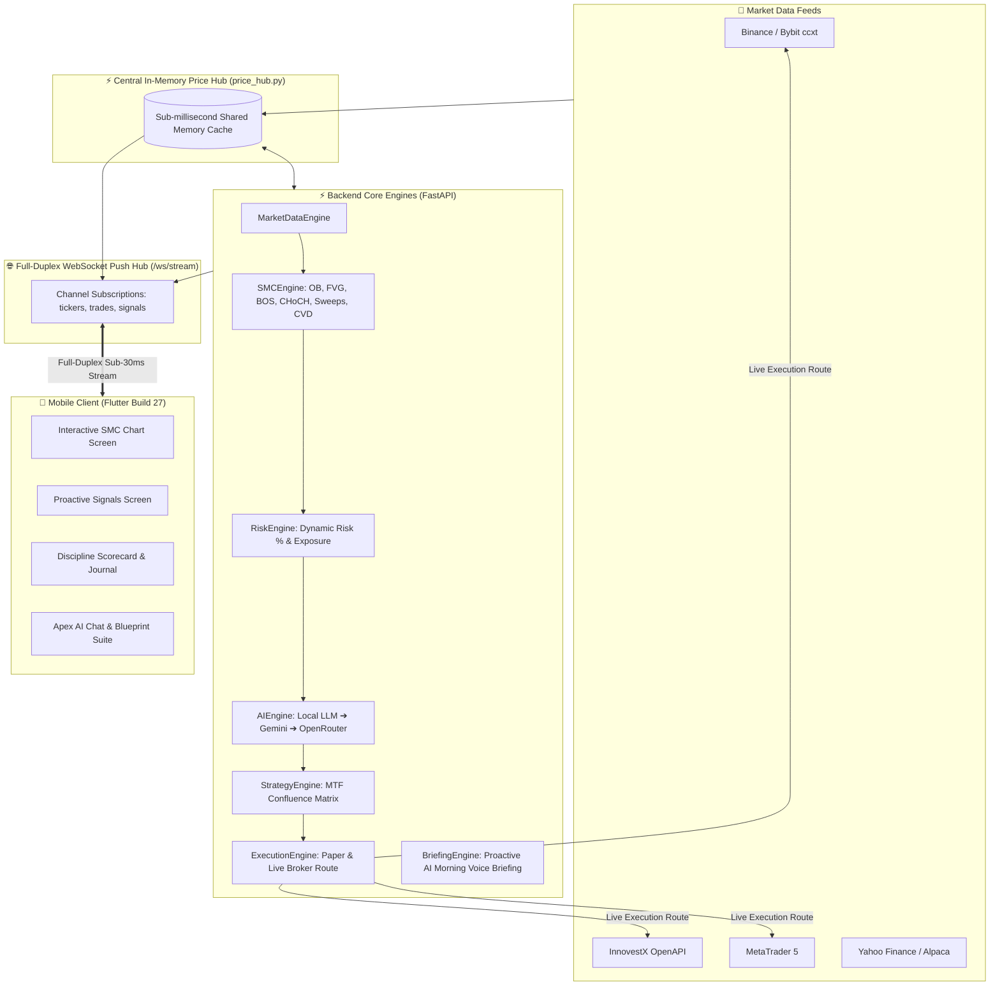

# 🦅 AI Trade Advisor (Apex AI)
### Institutional-Grade Smart Money Concepts (SMC) & Multi-Provider AI Trading Suite

[](https://fastapi.tiangolo.com)
[](https://flutter.dev)
[](https://www.docker.com)
[](https://opensource.org/licenses/MIT)

An advanced, full-stack trading intelligence platform designed for Crypto, Forex, Gold, and Thai/Global Equities. It merges institutional **Smart Money Concepts (SMC)** quantitative algorithmic detection with an autonomous **Multi-Provider AI Fallback Chain (Local LLM / LM Studio / Ollama → Google Gemini → OpenRouter / Claude)** and a high-performance Flutter mobile application with sub-30ms Full-Duplex WebSocket push streaming and real-time execution.

> 📚 **Detailed User Guide Available**: See [`USER_MANUAL.md`](file:///c:/Users/arthit.n/git/ai_trade_advisor/USER_MANUAL.md) for full screen-by-screen walkthroughs, indicator interpretations, and risk management guidelines in Thai.

---

## 🏛️ System Architecture (Phase 4 High-Performance Core)



---

## 💎 Core Features Across All 4 Completed Phases

### 🎯 Phase 1: Smart Execution & Dynamic Risk Suite (Build 24 ✅)
* **Dynamic Risk Position Sizer**: Automatically calculates exact units/lots based on percentage account risk (0.5%, 1.0%, 2.0%, 3.0%) and physical distance between Entry and Stop Loss:
  $$\text{Position Size} = \frac{\text{Account Capital} \times \text{Risk \%}}{\left|\text{Entry} - \text{Stop Loss}\right|}$$
* **Auto-Breakeven (Auto-BE)**: Moves Stop Loss to Entry price immediately when profit reaches $1.5\text{R}$ to eliminate downside risk.
* **Dynamic Trailing Stop**: Automatically locks in trend profits along structural swing points.

---

### 📊 Phase 2: Signal & Confluence Edge — MTF Alignment Matrix (Build 25 ✅)
* **Multi-Timeframe (MTF) Alignment Matrix**: Concurrently analyzes 4 distinct timeframes (`1D`, `4H`, `1H`, `15M`) for Macro Trend, Structural Bias, and Entry Confirmation.
* **Institutional Grade Badging**:
  * `🌟 SUPREME GRADE A+` (4/4 TF Aligned — Highest Probability)
  * `💎 GRADE A` (3/4 TF Aligned)
  * `⚖️ GRADE B` (2/4 TF Aligned)
  * `⏳ WAIT / CONFLICTED` (< 2/4 Aligned — Cash Preservation)
* **Volume Delta & Cumulative Volume Delta (CVD) Absorption**: Detects institutional limit order absorption and liquidity exhaustion (`🐳 CVD Absorption`).

---

### 🧠 Phase 3: AI Cognitive Loop & Post-Trade Intelligence (Build 26 ✅)
* **Discipline Scorecard (0–100)**: Quantitative behavioral score calculated from Plan Adherence % and Average Star Ratings (⭐⭐⭐⭐⭐):
  $$\text{Discipline Score} = \operatorname{clamp}((\text{Plan Adherence \%} \times 0.6) + (\text{Avg Star Rating} \times 8.0), 0, 100)$$
* **Cognitive Critique Engine**: Generates automated Thai post-trade breakdowns analyzing trade quality, emotional adherence, and actionable lessons learned.
* **Interactive AI Audit Modal Sheet**: Bottom sheet with star ratings, parameter tables, and `🔄 Re-Audit Trade with AI` button.

---

### ⚡ Phase 4: High-Performance Infrastructure & Voice Intelligence (Build 27 ✅)
* **Full-Duplex WebSocket Push Hub (`/ws/stream`)**: Sub-30ms reactive event streaming pushing continuous 300ms price ticks, open position PnLs, and signals directly to Mobile clients with automatic heartbeat & exponential reconnect.
* **Central In-Memory Price Hub (`price_hub.py`)**: Sub-millisecond in-memory shared price layer consolidating multi-exchange feeds and eliminating duplicate outbound REST calls.
* **Proactive AI Daily Voice Briefing (`/api/v1/briefing/morning`)**: Institutional morning voice script and audio speech synthesis in Thai summarizing Market Regime, Key SMC Levels, and Focus Setups.

---

## 📊 Complete Indicator & SMC Structure Suite

| Indicator / SMC Structure | Visual Representation | Quantitative Rule & Interpretation |
| :--- | :---: | :--- |
| **Bullish Order Block (OB)** | 🟢 Green Zone Box | Last bearish candle before aggressive expansion. Acts as high-probability demand zone. |
| **Bearish Order Block (OB)** | 🔴 Red Zone Box | Last bullish candle before aggressive selloff. Acts as institutional supply zone. |
| **Fair Value Gap (FVG)** | 🟣 Purple Imbalance | 3-candle price imbalance. Price tends to retrace and fill before trend continuation. |
| **Break of Structure (BOS)** | 📈 Solid Break Line | Candle body closing beyond previous swing high/low confirming trend continuation. |
| **Change of Character (CHoCH)**| 🔄 Reversal Tag | First structural break in opposite direction signaling potential trend reversal. |
| **Equilibrium 50% (EQ)** | ⚖️ Yellow Dashed Line| Dynamic 50% range midpoint. Longs strictly in Discount (<50%), Shorts in Premium (>50%). |
| **Liquidity Sweep (EQH/EQL)** | 🧹 Sweep Marker | High/Low wick penetration hunting retail stop losses followed by immediate rejection. |
| **CVD Volume Absorption** | 🐳 Absorption Badge | Price making lower lows while Cumulative Volume Delta rises (limit buy absorption). |
| **Multi-Timeframe Matrix** | 📊 4-TF Heatmap | Concurrent evaluation of 1D, 4H, 1H, 15M biases into Grades A+ through Wait. |

---

## 📸 Screenshots & Verification (Build 27)

| Feature | Screenshot |
| :--- | :--- |
| **AI Daily Voice Briefing** |  |
| **Full-Duplex WS Chart** |  |
| **Real-time Signals Screen** |  |
| **Live Journal & Scorecard** |  |

---

## 🚀 Quick Start

### 1. Backend Setup
```bash
cd backend
python -m venv .venv
source .venv/bin/activate  # Windows: .venv\Scripts\activate
pip install -r requirements.txt
cp .env.example .env
uvicorn app.main:app --reload --host 0.0.0.0 --port 8000
```

### 2. Docker Deployment
```bash
cd backend
docker compose up -d --build
```

### 3. Mobile Setup (Flutter)
```bash
cd mobile
flutter pub get
flutter run
# Build Release APK
flutter build apk --release
```

---

## 📡 Key API Endpoints Reference

| Method | Path | Description |
| :--- | :--- | :--- |
| `WS` | `/ws/stream` | Full-Duplex real-time streaming hub (tickers, trades, signals) |
| `GET` | `/api/v1/briefing/morning` | Proactive daily voice briefing script and focus setups in Thai |
| `GET` | `/api/v1/signals/mtf-matrix` | Multi-Timeframe Alignment Matrix for 1D, 4H, 1H, 15M |
| `GET` | `/api/v1/journal/scorecard` | Discipline Score (0–100), plan adherence %, and win rate |
| `POST` | `/api/v1/journal/entries/{id}/ai-review` | On-demand AI cognitive trade re-audit |
| `POST` | `/api/v1/trades/place` | Place paper or live trade order with dynamic risk sizing |
| `POST` | `/api/v1/trades/{id}/close`| Close active trade with realized PnL and AI review generation |
| `GET` | `/api/v1/chart/ohlcv` | Historical candlestick data across Crypto, Forex, Stocks |
| `GET` | `/api/v1/chart/overlay` | Quantitative SMC overlays (OB, FVG, BOS, CHoCH, EQ) |

---

## 📄 License
This project is licensed under the MIT License — see the [LICENSE](LICENSE) file for details.
