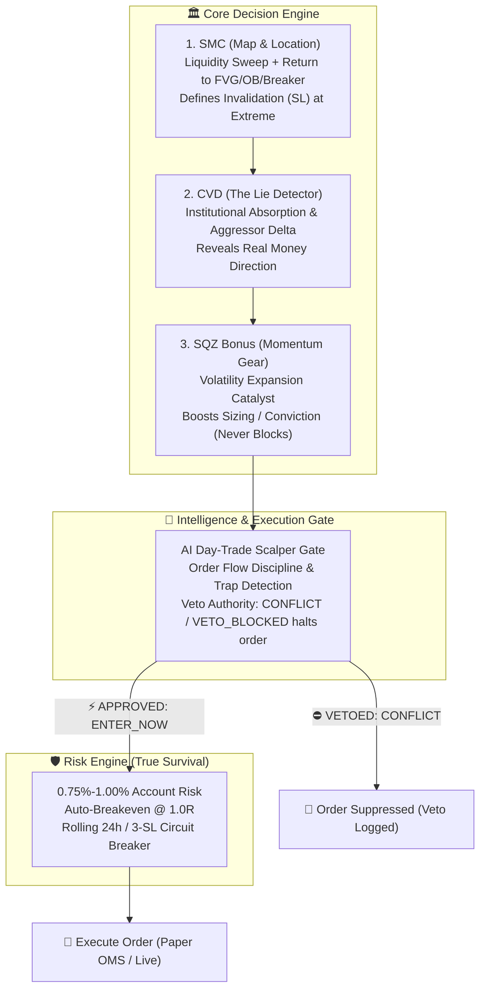
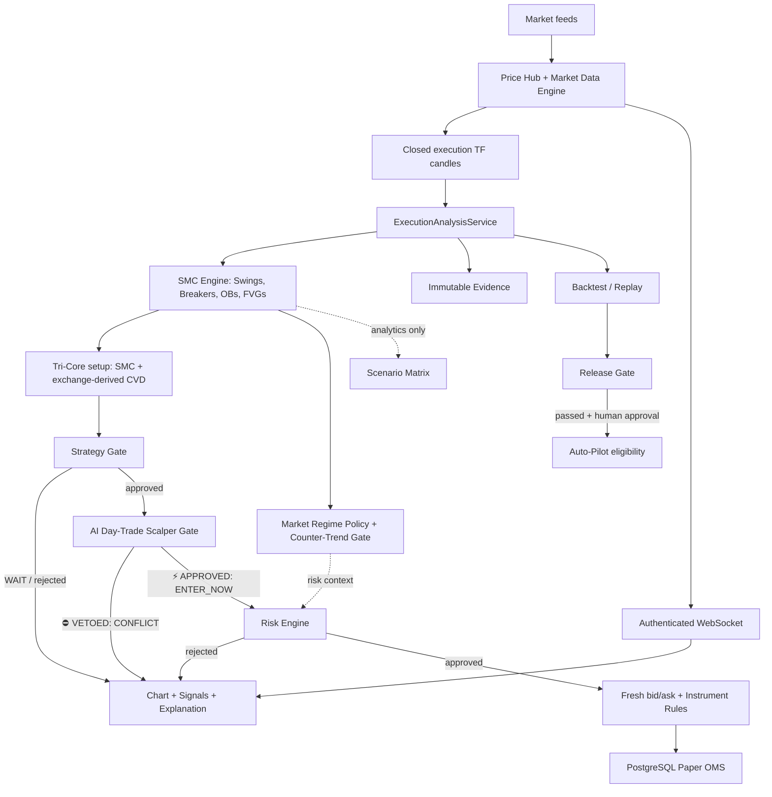

# AI Trade Advisor — Apex AI (Tri-Core Architecture)

> **"A trading system must not look for 100% certainty. It must identify an institutional edge, take the trade with decisive execution, and leave survival entirely to mathematical risk management."**

---

## 🏛️ Project Manifesto: Breaking Free from the Over-Filtering Trap

### 1. The Trap: Analysis Paralysis
In algorithmic and quantitative trading, the most common trap is **The Over-Filtering Trap** (กับดักความปลอดภัยเกินเหตุ).
When a system chains 8–10 independent restrictive gates together:
$$\text{SMC Structure} \rightarrow \text{HMM Regime} \rightarrow \text{Scenario S1–S8} \rightarrow \text{Inducement Gate} \rightarrow \text{CVD Delta} \rightarrow \text{CVD Absorption} \rightarrow \text{Squeeze Filter} \rightarrow \text{Candle Ratio} \rightarrow \text{AI Gate}$$

ถ้าสมมติให้แต่ละ gate เป็นอิสระและผ่าน 50% โอกาสผ่านแปด gate จะเหลือ $0.5^8 \approx 0.39\%$ ตัวเลขนี้เป็นเพียงภาพประกอบ ไม่ใช่สถิติจริงของระบบ แต่ชี้ให้เห็นความเสี่ยงจากการซ้อน veto จำนวนมาก

### 2. The Tri-Core Solution: Pure Edge + Institutional Flow + Sizing Catalyst
Survival in the financial markets does **not** come from stacking 10 indicator filters to avoid entering trades. ระบบใช้ base risk **0.75%**, ให้ SQZ เพิ่มได้ไม่เกิน **1.00%**, **Automated Breakeven at 1.0R**, และ circuit breaker 24 ชั่วโมงเมื่อ rolling loss แตะ **3%** หรือแพ้ SL ติดกันสามไม้



### 3. Comparison: Legacy vs. Tri-Core Architecture

| Dimension | Legacy Architecture (Over-Filtered) | Tri-Core Architecture (Apex AI) |
| :--- | :--- | :--- |
| **Core Philosophy** | Defensive Avoidance (Looking for reasons to NOT trade) | Decisive Confluence (Identify institutional sweep + absorption) |
| **SMC Role** | Rigid multi-rule constraint (BOS, OB, FVG, IDM all required) | **Map & Location**: Liquidity Sweep, OB/FVG Retest, Breaker Blocks |
| **CVD Role** | Restrictive pass/fail filter | **The Lie Detector**: Confirms absorption or aggressor flow |
| **Squeeze Role** | Mandatory negative gate (No squeeze = No trade) | **Positive Bonus & Sizing Multiplier** (Never blocks entry) |
| **AI Role** | Paranoid Gatekeeper (Prompted to find reasons to WAIT) | **Day-Trade Scalper Gate**: Senior Order Flow Scalper ตรวจสอบโครงสร้าง, ดักทาง Trap OB, และมีอำนาจ Veto ระงับคำสั่ง Auto-Pilot |
| **Survival Strategy** | Fear of entry (0 trades taken) | **Risk Engine**: 0.75–1.00%, Auto-BE at 1.0R, durable 24h halt |
| **Actionable Scenarios** | Artificial observation-only locks (S4/S8 blocked) | Actionable whenever Tri-Core confluence + $R:R \ge 2.0$ exists |

---

Scanner AI rollout: [แผนและ flow AI SMC+CVD](docs/ai-scanner-plan.md) — โมเดล AI ทำหน้าที่เป็น **Institutional Day-Trade Scalper Gate**: เมื่อ Tri-Core พบ setup ที่พร้อมเทรด AI จะตรวจ order flow, delta และ trap OB หาก AI ระบุ `CONFLICT` หรือ `VETO_BLOCKED` ระบบ Auto-Pilot จะระงับคำสั่งทันที (Vetoed) หากระบุ `COHERENT` และ `ENTER_NOW` คำสั่งจะได้รับอนุมัติพร้อมบันทึก AI audit trail ลง PostgreSQL

Migration/validation contract: [Canonical 15M migration](docs/canonical-15m-migration.md) — threshold ปัจจุบันเป็น `draft_unvalidated`, ระบุ data-readiness, lifecycle, Entry Engine และ rolling chronological OOS promotion gate

อัปเดต 2026-09-21: Execution TF ปัจจุบันคือ **15M** ตาม `backend/config/strategy.yaml` → `timeframe_profiles.roles.trigger.timeframe` ทุกเส้นทางตัดสินใจใช้ closed execution snapshot และ deterministic entry policy ร่วมกัน

`TriCoreSetupEngine` รองรับรูปแบบเข้าเทรดระดับสถาบัน:
1. **Sweep Reversal**: sweep + reclaim + CVD divergence/absorption ที่ผูกกับ swing และ reclaim เดียวกัน
2. **Displacement Continuation**: displacement break structure + first retest ของ OB/FVG จาก lineage เดียวกัน
3. **Breaker Block Retest**: การทดสอบ Breaker Block ที่กลับทิศทาง (Flip) พร้อมการยืนยัน non-opposing flow
4. **Trend-Day Shallow Retest**: FVG 50% Consequent Encroachment (CE) และ Breaker front-run buffer (`<= 0.15 ATR`) ในวันที่มีแนวโน้มแรง
5. **Macro Counter-Trend Veto Gate**: ในสภาวะ Trending Bullish หรือ HTF Bullish จะทำการ Veto สัญญาณฝั่ง Short สวนเทรนด์ทุกประเภทเพื่อป้องกันการติดกับดักในรอบกระทิงใหญ่

ระบบวาง SL หลัง extreme ของ breach window ทั้งชุด, เลือก TP ที่ opposing obstacle ใกล้ที่สุด และอนุมัติเฉพาะเมื่อ $R:R \ge 2.0$ โดยมี AI Day-Trade Scalper เป็นด่านตรวจสุดท้ายก่อนยิงออเดอร์ ส่วน Scenario S1–S9 เป็น analytics label เท่านั้น

Client ไม่มี API key สำรองใน source/bundle อีกต่อไป ตั้งค่า key ใน Settings จาก `APP_SECRET_KEY` ของ backend ที่ผู้ดูแลจัดเตรียมให้ หลังหมุน key ต้องตั้งค่าบนอุปกรณ์ใหม่ ห้ามส่ง key ผ่าน URL หรือ commit ลง Git

Release Android ต้องตั้ง `ANDROID_KEYSTORE_PATH`, `ANDROID_KEYSTORE_PASSWORD`, `ANDROID_KEY_ALIAS`, `ANDROID_KEY_PASSWORD`; emulator ใช้ debug APK ได้ HTTP อนุญาตเฉพาะ localhost/127.0.0.1/10.0.2.2 และเซิร์ฟเวอร์อื่นต้อง HTTPS ข้อมูลพอร์ต/runtime JSON เก็บไว้ในเครื่องและไม่นำเข้า Git หรือ Docker image; สำรอง volume/config ก่อนย้ายเครื่อง

Dependency สำหรับ Linux/Python 3.12 deployment ถูกตรึงใน `backend/requirements.lock` จากเวอร์ชันที่รันจริง รายละเอียดการแก้ review และข้อจำกัด: [review fixes](docs/review-fixes-2026-09-07.md)

ระบบวิเคราะห์และจำลองการเทรดแบบ full-stack สำหรับ Crypto, Forex, Gold และหุ้น พัฒนาด้วย FastAPI, Flutter, PostgreSQL, Redis และ Docker โดยใช้ Smart Money Concepts (SMC), Volume Delta/CVD และ Squeeze Momentum เป็นแกนตัดสินใจแบบ deterministic พร้อม Scenario Engine, Risk Engine, Paper OMS, AI Advisor, Evidence Replay และ Backtest Release Gate

> สถานะล่าสุด: ระบบตัดสินใจใช้เฉพาะแท่งปิดของ **Execution Timeframe 15M** (`execution_timeframe_only`) เท่านั้น ข้อมูล MTF/HTF ห้ามนำมาคำนวณคะแนน ยืนยัน setup กำหนดขนาดสถานะ หรือออกคำแนะนำเทรด

> ระบบนี้เป็นเครื่องมือวิเคราะห์และ Paper Trading ไม่รับประกันผลกำไร Auto-Pilot ปิดเป็นค่าเริ่มต้น และ Live Trading ยังถูกป้องกันด้วย safety gate

## Technology Stack

| Layer | Technology |
| --- | --- |
| Client | Flutter 3 / Dart, Riverpod, Dio, GoRouter, WebSocket |
| API | Python 3.12, FastAPI, Pydantic, SQLAlchemy Async |
| Data | PostgreSQL 16, Redis 7, SQLite สำหรับประวัติแชต |
| Market data | Binance WebSocket + REST recovery, CCXT, Yahoo Finance/ผู้ให้บริการ fallback |
| AI | Ollama/LM Studio/OpenAI-compatible → Gemini → OpenRouter |
| Deployment | Docker Compose, Nginx, Android APK/Web build |

## Features ล่าสุด

### Chart และ Market Intelligence

- กราฟแท่งเทียนพร้อมราคาสดและข้อมูล OHLCV
- Clean SMC overlay: Order Block, FVG, BOS, CHoCH, EQ 50%, Equal High/Low, Swing High/Low และ Liquidity Sweep
- แสดง Market Regime, คะแนน 3-Indicator Core, Strategy Gate, Scenario และ Execution Blueprint
- หน้า Chart มี Apex AI Chat, AI Blueprint และรายการ Position
- รองรับ watchlist แยก Crypto, Forex/Gold และ Stocks
- Binance ใช้ WebSocket และมี sequence-gap recovery/freshness monitoring
- ตลาดที่ยังไม่มี broker-native stream ถูกระบุเป็น polling fallback อย่างชัดเจน

### Deterministic Trading Intelligence

- Canonical decision pipeline เดียวกันสำหรับ Chart, Signals, Scanner และ Backtest
- วิเคราะห์เฉพาะแท่ง 15M ที่ปิดแล้ว ป้องกัน repaint จากแท่งที่ยังวิ่ง
- SMC+CVD เป็น deterministic entry authority; SQZ เป็นโบนัส sizing แยก
- Market Regime เป็น risk context ไม่ใช่ entry veto และไม่เพิ่มคะแนนซ้ำ
- Scenario Matrix จัดกลุ่มสถานการณ์ตาม causal trigger แบบเรียงลำดับความสำคัญ
- Strategy Gate อ่านเฉพาะ causal `tri_core_setup`, exchange-derived aggressor CVD, geometry และ R:R
- TP ต้องมาจาก liquidity/structure จริง ระบบไม่สร้างเป้า 2R/3R เพื่อทำให้ setup ดูผ่าน

### Risk และ Execution

- คำนวณ position size จาก risk budget และระยะ Entry–SL แบบรวมค่าธรรมเนียม spread และ slippage
- ตรวจ rolling 24h loss, แพ้ SL สามไม้ติด, drawdown, จำนวน position, correlated asset cluster, leverage และ quantity step
- ตรวจ tick size, lot size และ minimum notional ตาม instrument/exchange
- PostgreSQL Paper OMS เป็น source of truth สำหรับ Order, Position, Fill และ Event
- รองรับ market/limit order, partial fill, partial TP, Auto-BE, trailing stop, fee/slippage model และ restart recovery
- Auto-Pilot ต้องใช้ราคาสดที่ executable และ `approved RiskAssessment`; ข้อมูล stale หรือ metadata ไม่ครบจะ fail closed
- Live mode ใช้ short-lived session, kill switch และ guarded gateway; AI ไม่สามารถเปิด Live หรือข้าม Risk Engine ได้

### AI, Journal และ Evidence

- Apex AI Chat & AI Day-Trade Scalper Gate:
  - **Auto-Pilot Execution Gatekeeper**: ทำหน้าที่เป็น Senior Order Flow Scalper ตรวจสอบความสอดคล้องของ Taker Delta, ดักทาง Trap Order Block, ป้องกันการ Chasing เข้าแนวต้าน/แนวรับสำคัญ
  - **Veto Authority**: มีอำนาจยับยั้งคำสั่ง Auto-Pilot ทันทีเมื่อเกิด `CONFLICT` หรือ `VETO_BLOCKED`
  - **Audit Trail**: บันทึก `ai_scalper_approved`, `ai_scalper_verdict`, `ai_scalper_action` และ `ai_scalper_reason` ลงใน PostgreSQL ทุกออเดอร์
- AI ปฏิเสธการใช้ MTF/HTF เพื่อคำนวณหรือยืนยันคำแนะนำ
- Provider fallback: Local/Ollama/LM Studio → Gemini → OpenRouter
- Ollama native adapter รองรับโมเดล reasoning และ output budget 2,048 tokens เพื่อป้องกันประโยคถูกตัด
- ประวัติแชตแยก session และจัดเก็บใน SQLite
- Trading Journal, discipline scorecard และ rule-based post-trade review
- Immutable decision evidence, deduplication, single-event replay และ batch replay
- Execution-aware rolling chronological out-of-sample backtest และ deterministic release gate

## System Architecture



## Canonical System Flow

1. `PriceHub` รับราคาและ trade stream พร้อมตรวจ freshness และ sequence gap
2. `MarketDataEngine` สร้าง OHLCV และส่งเฉพาะแท่ง 15M ที่ปิดแล้ว
3. `ExecutionAnalysisService` snapshot ข้อมูลและ config พร้อมสร้าง `snapshot_id`
4. `SMCEngine` หาโครงสร้าง Swing/Internal, BOS, CHoCH, OB, FVG, EQ และ liquidity
5. `TriCoreSetupEngine` ใช้ SMC เป็น location/invalidation และ exchange-derived aggressor CVD เป็น intent; SQZ ไม่อยู่ใน eligibility
6. `RegimeEngine`, HMM, VPIN, derivatives, IDM และ Scenario Matrix สร้าง risk/analytics context แต่ไม่มีสิทธิ์ veto หรืออนุมัติ entry
7. `StrategyEngine` ตรวจ causal Tri-Core metadata, direction, geometry และ structural $R:R \ge 2.0$
8. หากไม่ผ่าน ระบบคืน `WAIT`; AI จะไม่ถูกเรียก และสถานะระบุ `not_requested`
9. หากผ่าน AI อาจตรวจ narrative coherence แบบ advisory แต่ผล AI ห้ามเปลี่ยน setup
10. หากผ่าน `RiskEngine` ตรวจ portfolio guardrails และคำนวณขนาดสถานะจาก all-in risk
11. ก่อนส่งคำสั่ง ระบบตรวจ bid/ask สด, cooldown และ exchange instrument rules
12. `PaperOMS` จำลอง fill, fee, spread, slippage, SL/TP, Auto-BE และ trailing พร้อม durable 24h risk halt แบบ transactional
13. Evidence, order, fill และ transition ถูกจัดเก็บเพื่อ replay, backtest และ audit

Chart, Signals, Scanner และ Backtest เรียก pure decision function เดียวกัน (`analyze_execution_frame`) เพื่อลดความคลาดเคลื่อนระหว่างผลย้อนหลังกับ runtime

## Decision Logic

### 1. Execution timeframe authority

- Timeframe ที่ใช้ตัดสินใจ: `execution TF`
- ใช้ completed candle เท่านั้น
- Live quote ใช้แสดงราคาและจำลอง execution ไม่ถูกนำไปเพิ่มเป็นแท่งวิเคราะห์ที่ยังไม่ปิด
- Proactive Scanner ตรวจ snapshot ที่ cache ไว้ทุก 15 วินาที จึงรับแท่งปิดใหม่ได้ภายในประมาณ 0–15 วินาทีหลังข้อมูลปิดพร้อมใช้งาน
- `htf_bias` ถูกตั้งเป็น neutral ใน canonical execution path
- endpoint MTF เดิมมีไว้สำหรับ research/compatibility เท่านั้น
- MTF ห้ามมีส่วนใน confluence, Strategy Gate, RiskAssessment, position sizing, Auto-Pilot และ AI trade advice

### 1.1 SMC detection semantics

- Reference defaults ของ `SMCEngine` ใช้ Swing/Internal length `50/5`; execution profile execution TF ใช้ tuned profile `3/2` แยกต่างหากและไม่อ้างว่าให้จุดตรง LuxAlgo แบบ 1:1
- Order Block volatility filter ใช้ Wilder ATR(200) แบบเดียวกับ Pine `ta.atr`; Internal Confluence Filter เป็นตัวเลือกและปิดเป็นค่าเริ่มต้น
- EQH/EQL ใช้ confirmation 3 แท่งและ tolerance `0.1 × ATR(200)` ไม่ใช้เปอร์เซ็นต์จากราคาสินทรัพย์
- OB/FVG ที่ยังไม่ถูก mitigation จะไม่หมดอายุเพียงเพราะเกิน lookback; จำนวนที่ส่งไป UI ถูกจำกัดแยกจาก validity ใน decision state
- Premium และ Discount เป็นแถบปลาย range อย่างละ 5%; Equilibrium เป็นช่วง 47.5–52.5%; พื้นที่ที่เหลือเป็น `mid_range` และไม่ถูกนับเป็น EQ
- Chart ใช้ `clean_v1` overlay แสดงเฉพาะ zone/structure สำคัญเพื่อไม่ให้เส้นทับกราฟ ส่วน decision engine ยังเก็บ state ที่ครบกว่า
- การตรวจทั้งหมดใน canonical decision path ใช้ข้อมูล execution TF timeframe เดียว ไม่มี Previous D/W/M levels หรือ MTF FVG เข้าคะแนนและการตัดสินใจ
- BOS/CHoCH ที่ยืนยันแล้วถูก latch ภายใน execution profile ไม่เกิน 3 แท่ง execution TF เพื่อเชื่อม reaction, structure shift และ squeeze ที่เกิดคนละแท่ง โดยไม่อ่านข้อมูล timeframe อื่น

### 2. Tri-Core decision

| Layer | อำนาจ | หน้าที่ |
| --- | --- | --- |
| SMC | Required | กำหนด location, entry, invalidation และ structural target แบบ causal |
| Exchange-derived CVD | Required | Binance Kline เป็น `kline_derived`; candle จาก aggTrades เป็น `aggtrade_derived` |
| Squeeze Momentum | Bonus only | เพิ่ม risk จาก 0.75% ได้ไม่เกิน 1.00%; ไม่มีสิทธิ์เปิดหรือปิด setup |

ตลาดที่ไม่มี exchange-derived aggressor buy/sell volume จะเป็น `WAIT` แทนการเรียก candle-volume estimate ว่า CVD จริง หน้าสแกนจะแสดง provenance ว่าเป็น Kline หรือ aggTrades, evidence score แยก `L/S` และ SQZ bonus แยก `+0..10`

### 3. Market Regime policy

Regime เป็น risk context เท่านั้น ไม่อนุมัติหรือ veto Tri-Core setup และไม่เพิ่มคะแนนซ้ำ Risk Engine ใช้ multiplier เพื่อลดขนาดในสภาวะผันผวน/กระจุกตัว; `unknown` ที่ข้อมูลไม่พร้อมยัง fail closed ในชั้น Risk

### 4. Strategy Gate

Setup จะออกจาก `WAIT` เมื่อ `tri_core_setup.actionable=true`, SMC และ exchange-derived CVD ยืนยันฝั่งเดียวกัน, provenance พร้อม, direction/geometry ถูกต้อง และ structural R:R ถึงเกณฑ์ ไม่มี Scenario, confluence threshold, premium/discount, SQZ, HMM, VPIN, IDM, derivatives หรือ AI veto ซ้อนในชั้นนี้

## คู่มือใช้งานหน้า Proactive SMC Scanner

### วิธีอ่านคะแนนและป้ายสถานะ

| สิ่งที่แสดง | ความหมาย | ใช้เปิดออเดอร์หรือไม่ |
| --- | --- | --- |
| `SMC+CVD evidence Lxx/Syy` | ความแข็งแรงของหลักฐานฝั่ง Long และ Short ที่คำนวณแยกกัน แม้ระบบยังเป็น WAIT | **ไม่ใช่คำสั่งเข้าเทรด** |
| `selected xx/100` หรือ `Evidence score` | ฝั่งที่มีหลักฐานสูงกว่า หรือฝั่งของ setup ที่กำลังตรวจ | ใช้อธิบายเท่านั้นเมื่อไม่มี active setup |
| `SQZ bonus +0..10` | Momentum catalyst สำหรับเพิ่มขนาดความเสี่ยงหลัง setup ผ่าน | ไม่สร้างและไม่ veto setup |
| `NO ACTIVE SETUP` | ยังไม่มี causal pattern ที่เข้าเงื่อนไข Tri-Core | ห้ามเข้า |
| `SETUP A` / `SETUP S` | Tri-Core ยืนยัน causal setup แล้ว | ส่งต่อ Strategy/Risk Gate ได้ |
| `LONG/SHORT BIAS · NOT ENTRY` | มี directional evidence แต่ entry geometry หรือ causal confirmation ยังไม่ครบ | ห้ามเข้า/ห้ามไล่ราคา |
| `Setup Ready • Risk pending` | Strategy ผ่านแล้ว แต่ยังต้องให้ Risk Engine ตรวจพอร์ตและขนาดไม้ | ยังไม่รับประกันว่าจะส่งคำสั่ง |

คะแนน Evidence ไม่มี threshold สำหรับเปิดออเดอร์และ **คะแนน 60, 70 หรือ 90 ไม่ได้ทำให้ AI หรือระบบเข้าเทรดโดยอัตโนมัติ** ตัวอย่างเช่น `L8/S66` หมายถึงหลักฐานเอน Short แต่หากแนวรับใกล้เกินไปจน R:R ต่ำ ระบบยังต้อง WAIT

### ระบบจะเรียก AI เมื่อใด และ AI SCALPER GATE ทำงานอย่างไร

AI บนหน้า Scanner ถูกเรียกเมื่อครบทั้งสองข้อ:

1. `tri_core_setup.actionable == true`
2. `strategy.approved == true`

- หากยังไม่มี deterministic setup จะแสดงสถานะ `AI ADVISORY & SCALPER GATE • ยังไม่เรียก AI` พร้อมคำชี้แจง:
  `AI SCALPER GATE: ตรวจสอบความถูกต้องของออเดอร์ก่อนอนุมัติเข้าเทรดสไตล์ Day Trade / Scalp` และ `No deterministic Tri-Core setup; AI was not requested` นี่เป็นพฤติกรรมที่ตั้งใจไว้ ไม่ใช่ปัญหาการเชื่อมต่อ AI เพราะ AI Scalper มีหน้าที่ตรวจความเสี่ยงของ setup ที่ผ่านเกณฑ์ทางสถิติแล้ว ไม่ได้ใช้คะแนน Evidence ลอยๆ เพื่อเดาทิศทาง
- เมื่อมี Setup เกิดขึ้น AI จะถูกเรียกเพื่อทำหน้าที่เป็น **Execution Gate**:
  - ⛔ `AI SCALPER GATE: คำสั่งถูกยับยั้งโดย AI Day Trader (Vetoed)`: หากพบ Taker Delta สวนทาง, ตลาดกำลังขยายตัวฝืนทิศทาง, หรือเป็น Trap Order Block ระบบ Auto-Pilot จะระงับการเข้าเทรดทันที
  - ⚡ `AI SCALPER GATE: ได้รับการอนุมัติโดย AI Day Trader (Approved)`: หากโครงสร้างและ Order Flow สอดคล้องกัน AI จะอนุมัติและระบุ action `ENTER_NOW` หรือ `LIMIT_RETEST` เพื่อส่งต่อให้ Risk Engine คำนวณขนาดไม้

ลำดับการตัดสินใจจริง (Execution Flow):

```text
Evidence L/S
  → causal SMC pattern (Swings, Breaker Blocks, OB/FVG Retest, Shallow Retests)
  → exchange-derived aggressor CVD confirmation
  → nearest opposing target และ R:R ≥ 2.00
  → Macro Regime Counter-Trend Gate (บล็อก Short ในสภาวะ Trending Bullish)
  → Tri-Core actionable
  → Strategy approved
  → AI Day-Trade Scalper Gate (Senior Scalper ตรวจ Order Flow & Trap OB)
      ├─ ⛔ VETO_BLOCKED / CONFLICT → ระงับการเข้าเทรด (Vetoed)
      └─ ⚡ ENTER_NOW / COHERENT    → อนุมัติส่งต่อ (Approved)
  → Risk Engine / portfolio guardrails
  → Paper order (PostgreSQL OMS)
```

### รูปแบบเข้าเทรดที่อนุญาต

1. **Sweep reversal** — ราคากวาด swing liquidity แล้วปิด reclaim, CVD divergence/absorption ต้องผูกกับ swing และ reclaim เดียวกัน, SL อยู่หลัง extreme ต่ำ/สูงสุดของ breach window ทั้งชุด
2. **Displacement continuation** — displacement ต้อง break structure และราคากลับมาทดสอบ OB/FVG จาก lineage เดียวกันเป็นครั้งแรก พร้อม aggressor delta สนับสนุน

ทั้งสองรูปแบบเลือก Take Profit ที่ opposing obstacle ใกล้ที่สุด ห้ามข้ามแนวรับ/แนวต้านใกล้เพื่อเลือกเป้าไกลกว่า หาก R:R จากเป้าแรกต่ำกว่า `2.00` ระบบต้อง WAIT

### ตัวอย่าง SOL: Evidence 66 แต่ AI ไม่ทำงาน

```text
SMC+CVD evidence L8/S66
Nearest opposing obstacle provides R:R 0.05 < 2.00
```

การตีความคือมีหลักฐานฝั่ง Short มากกว่าฝั่ง Long แต่ราคาปัจจุบันอยู่ใกล้ opposing support/target มากเกินไป Reward เหลือเพียง `0.05R` ต่อ Risk `1R` จึงไม่มี active setup, Strategy เป็น WAIT และ AI ไม่ถูกเรียก การเปิด Short ในจุดนี้จะเป็นการไล่ราคา ไม่ใช่ deterministic entry

### Checklist ก่อนกดเข้า Paper Trade

- ป้ายหลักต้องเป็น `BUY / LONG` หรือ `SELL / SHORT` ไม่ใช่ `WAIT`
- ต้องเป็น `SETUP A` หรือ `SETUP S`; คะแนน Evidence อย่างเดียวไม่พอ
- ต้องมี Entry, Stop Loss, Take Profit และ R:R ที่ backend ส่งมาอย่างครบถ้วน
- ต้องผ่าน Risk Engine; ขนาดไม้ให้ใช้ค่าที่ Risk Engine คำนวณ ห้ามคำนวณจาก SQZ bonus เอง
- ตรวจว่า snapshot เป็นแท่ง execution TF ที่ปิดแล้วและข้อมูลไม่ stale
- หากแสดง `NOT ENTRY`, `NO ACTIVE SETUP`, `Risk pending` หรือ rejection reason ใด ๆ ห้ามเปิดคำสั่งเอง

## Scenario Matrix

Scenario ถูกประเมินเพื่ออธิบายและเก็บสถิติเท่านั้น ตารางเดิมด้านล่างเป็น taxonomy ของตลาด ไม่ใช่ลำดับ gate และค่า `actionable`/Grade ภายใน Scenario ไม่มีอำนาจต่อ Strategy หรือ Auto-Pilot

| Priority | Scenario | เงื่อนไขหลัก | ผลลัพธ์ |
| ---: | --- | --- | --- |
| 1 | `S1_BULL_BREAKOUT` / `S1_BEAR_BREAKDOWN` | BOS/CHoCH ที่มี registered event level, squeeze fire ทิศเดียวกัน, candle/volume preflight ผ่าน, ราคาไม่ยืดเกิน 1.25 ATR, มี structural target และ R:R ≥ 1.5 | Grade S, market candidate |
| 2 | `S2_BULL_OB_RETEST` / `S2_BEAR_OB_RETEST` | แตะ OB ใดก็ตามใน active OB collection ที่ตรงฝั่งและอยู่ใน Discount/Premium พร้อม rejection close และ aligned delta/absorption; มี target จริงและ R:R ≥ 1.5 | Grade A/S, limit-at-OB candidate |
| 3 | `S3_BEAR_TOP_SWEEP` / `S3_BULL_BOTTOM_SWEEP` | Sweep ต้องตรง registered EQH/EQL หรือ swing liquidity, อยู่ใน location ที่เหมาะสม, order flow ยืนยัน และไม่สวน squeeze/regime รุนแรง | Grade S, reversal candidate |
| 4 | `S4_BEAR_BREAKER_FLIP` / `S4_BULL_BREAKER_FLIP` | CHoCH พร้อม delta ทิศเดียวกัน มี opposing structural target และ R:R ≥ 1.5 | Grade A, breaker candidate |
| 5 | `S8_SUPPORT_*` / `S9_RESISTANCE_*` | แท่ง execution TF ที่ปิดแล้วแตะ OB, EQH/EQL, Swing หรือ Strong/Weak level; แยก Touch, Bounce/Rejection, Breakdown/Breakout และ False Break จากตำแหน่งปิด, body และ Delta/absorption | Touch/Break watch เป็น observation; Bounce/Rejection ที่มี target จริง, R:R ≥ 1.5 และราคาไม่ยืดเกิน 1.25 ATR เปิด `ENTRY_WINDOW_OPEN` ได้นาน 3 แท่ง |
| 6 | `S6_DIVERGENCE_EXHAUSTION` | Momentum/Delta อ่อนแรงใน Premium หรือ Discount | WAIT; กระชับ SL/เฝ้ารอ ไม่เปิดสถานะใหม่ |
| 7 | `S5_MID_RANGE_COMPRESSION` | Squeeze-on หรือ regime compression บริเวณ equilibrium | WAIT; เฝ้ารอ close ยืนยันออกจากกรอบ |
| Fallback | `NEUTRAL_NO_EDGE` | ไม่มี causal trigger ที่ผ่านเกณฑ์บนแท่งปิด | WAIT |

ข้อสำคัญ: Grade S/A จาก Scenario ไม่ใช่คำสั่งเทรด; Grade ที่ execution ใช้อ่านจาก causal `tri_core_setup` เท่านั้น

`S8_SUPPORT_*` และ `S9_RESISTANCE_*` ไม่ทำนายว่าแท่งถัดไปต้องขึ้นหรือลง และไม่ใช้ MTF ในการคำนวณหรือให้คะแนน ผลลัพธ์ถูกส่งใน `signal.reaction` พร้อม `reaction_age_bars`, จำนวนแท่งที่เหลือ และระยะ extension เป็น ATR หาก reaction เป็น Primary Scenario และครบเงื่อนไข ระบบเปิด `ENTRY_WINDOW_OPEN`; หากไม่ครบยังเป็น observation ตามเดิม ป้าย setup ที่ Strategy Gate ยังไม่อนุมัติจะแสดง `LONG/SHORT BIAS · NOT ENTRY` พร้อม rejection reasons

## Risk Engine และ Position Sizing

Risk Engine คำนวณจากระยะขาดทุนแบบ all-in:

```text
all_in_risk_per_unit = abs(entry - stop_loss) + execution_cost_per_unit
risk_budget = account_balance × effective_risk_percent
position_size = floor_to_step(risk_budget / all_in_risk_per_unit)
net_RR = (gross_reward - execution_cost) / (stop_distance + execution_cost)
```

Guardrails หลัก:

- Rolling 24-hour loss 3% หรือ SL ติดกันสามไม้จะสร้าง durable halt 24 ชั่วโมงใน PostgreSQL
- Maximum open positions
- Maximum 2 positions ทิศเดียวกันใน correlated asset cluster
- Position ที่สองใน cluster เดียวกันลด risk เหลือ 50%
- Drawdown 5%/10% ลด risk budget ตามลำดับ
- SL distance สูงสุดตาม global/runtime constraint
- Leverage/notional cap และ quantity-step rounding
- Tick size, lot size และ minimum notional
- Reject ค่า NaN/Infinity, ราคาไม่เป็นบวก และ geometry ผิดทิศ

## Auto-Pilot Safety Flow

Auto-Pilot ปิดเป็นค่าเริ่มต้นใน `backend/config/runtime_settings.json`

การเปิดใช้งานต้องมี release gate ล่าสุดที่:

- เป็น timeframe 15M ตาม policy version ที่ทดสอบ
- ใช้ `rolling_walk_forward_oos` อย่างน้อย 3 chronological folds
- มี completed trades อย่างน้อย 100 รายการ
- มีอย่างน้อย 20 trades ต่อ scenario ที่ถูกทดสอบ
- ผ่าน expectancy, profit factor, drawdown, fill-rate และ regime coverage
- ยังต้องผ่าน Paper validation และ human approval

ทุก Auto-Pilot order ต้องมี approved `RiskAssessment`, fresh executable quote, instrument rules และ durable cooldown ระบบจะไม่สร้าง TP สำรองหรือเพิ่มขนาดเกิน RiskAssessment

Release gate ปัจจุบันไม่ได้ promote strategy หรือเปิด Production อัตโนมัติ

## Paper OMS Lifecycle

```text
Order:    submitted → partially_filled → filled / cancelled
Position: pending → open → managed / partial close → closed
```

- PostgreSQL เป็น authoritative state
- JSON stores เป็น compatibility projection/migration source เท่านั้น
- Bid/ask, spread, slippage และ fee ถูกใช้ใน fill/risk model
- Market order ต้องมี fresh quote
- Auto-BE ไม่ทำให้ SL แย่ลง
- Trailing protection: 1.5R, 2.0R และ dynamic หลัง 2.5R
- Recovery หลัง restart โหลด pending/open state โดยไม่ duplicate import

## AI Advisor Boundary

AI มีหน้าที่อธิบาย context, rejection reason, scenario และ risk เป็นภาษาไทย โดยมีข้อจำกัดดังนี้:

- ห้ามข้าม Strategy Gate หรือ Risk Engine
- หาก deterministic result เป็น rejected คำตัดสินสุดท้ายต้องเป็น `WAIT`
- ห้ามใช้หรือกล่าวอ้าง MTF/HTF เพื่อยืนยัน ปฏิเสธ ให้คะแนน หรือกำหนดขนาดเทรด
- Market context ถูกส่งเป็น untrusted data ไม่ใช่ system instruction
- Provider ล้มเหลวจะ fallback ตาม chain และแสดงสถานะ unavailable อย่างตรงไปตรงมา
- API key ต้องมาจาก environment/secret storage ห้าม commit ลง repository

## Evidence, Backtest และ Release Validation

- Evidence ผูก market-data hash, config hash, decision hash และ timestamp
- Duplicate scanner decisions ถูก deduplicate โดยไม่เขียน payload ซ้ำ
- Replay ใช้ snapshot/config เดิมเพื่อตรวจ reproducibility
- Backtest ใช้ canonical execution TF decision function เดียวกับ runtime
- Execution simulation รวม spread, slippage, fee, volume capacity, partial fills และ conservative same-bar SL/TP ordering
- ค่าเริ่มต้นใช้ rolling walk-forward OOS อย่างน้อย 3 ช่วงตามลำดับเวลาและไม่ซ้อนกัน; โหมด anchored single split มีไว้ตรวจเร็วและไม่ผ่าน promotion gate ค่าเริ่มต้น
- Empirical reclaim/extension percentiles จาก outer OOS เป็น diagnostics เท่านั้น ห้ามนำกลับไปเลือก threshold

Default release criteria:

| Metric | Threshold |
| --- | ---: |
| Completed trades | ≥ 100 |
| Trades per scenario | ≥ 20 |
| Expectancy | ≥ 0.05R |
| Profit factor | ≥ 1.15 |
| Max drawdown | ≤ 12% |
| Fill rate | ≥ 70% |
| Regimes tested | ≥ 2 |
| Exchange-derived aggressor coverage | ≥ 95% |
| Empirical history | ≥ 90 days |
| Tri-Core policy | `walk_forward_validated` |
| Chronological OOS folds | ≥ 3 |

## Client Screens

| Screen | หน้าที่ |
| --- | --- |
| Chart | Candlestick, clean SMC overlay, Strategy Gate, Scenario, AI Chat/Blueprint และ Positions |
| Signals | Watchlist scanner, live prices, grade/rejection diagnostics และ manual scan |
| Journal | Trade history, statistics, discipline scorecard และ post-trade review |
| Apex AI | Chat sessions, persistent history และ market-aware explanations |
| Settings | API connection, LLM providers, risk, Auto-Pilot gate, brokers, watchlist, prompts และ kill switch |

## Key API Endpoints

ทุก protected endpoint ใช้ header `X-API-Key`

| Method | Endpoint | Description |
| --- | --- | --- |
| `GET` | `/health`, `/ready` | Liveness และ dependency readiness |
| `GET` | `/api/v1/chart/ohlcv` | Historical candles |
| `GET` | `/api/v1/chart/overlay` | Canonical execution TF SMC/strategy overlay |
| `POST` | `/api/v1/signals/analyse` | Deterministic analysis + evidence |
| `POST` | `/api/v1/signals/scan` | Scan watchlist |
| `GET` | `/api/v1/signals/mtf-matrix` | Research/compatibility only; ไม่มี decision authority |
| `POST` | `/api/v1/settings/llm/chat` | Apex AI Chat |
| `GET/POST` | `/api/v1/paper/orders` | Paper OMS orders |
| `GET` | `/api/v1/paper/account` | Paper account snapshot |
| `GET` | `/api/v1/evidence/events` | Query immutable evidence |
| `POST` | `/api/v1/evidence/events/{id}/replay` | Deterministic replay |
| `POST` | `/api/v1/backtests/runs` | Anchored OOS backtest |
| `POST` | `/api/v1/backtests/runs/{id}/release-gate` | Evaluate release criteria |
| `POST` | `/api/v1/live/session` | Open guarded short-lived Live session |
| `POST` | `/api/v1/live/kill-switch` | Disable Live capability |
| `WS` | `/ws/stream` | Authenticated price/trade/signal push |

## Quick Start

### Docker Compose (แนะนำ)

สร้างไฟล์ environment ก่อน:

```powershell
Copy-Item backend/.env.example backend/.env
Copy-Item .env.example .env
```

กำหนด `APP_SECRET_KEY`, `POSTGRES_PASSWORD`, `DATABASE_URL` และ provider credentials ที่ต้องการ จากนั้นรันจาก project root:

```powershell
docker compose up -d --build
docker compose ps
Invoke-RestMethod http://localhost:8000/ready
```

- Web: `http://localhost:3000`
- API: `http://localhost:8000`
- OpenAPI: `http://localhost:8000/docs`

### Backend แบบ local

```powershell
cd backend
python -m venv .venv
.\.venv\Scripts\Activate.ps1
pip install -r requirements.txt
python -m uvicorn app.main:app --reload --host 0.0.0.0 --port 8000
```

### Flutter Web & Mobile

```powershell
cd mobile
flutter pub get

# รันแบบ Development ในเครื่อง:
flutter run

# บิลด์ Web สำหรับ Production (Nginx Container พอร์ต 3000):
flutter build web --release
Copy-Item -Path "build\web\*" -Destination "..\web_dist" -Recurse -Force
docker restart ai_trade_web

# บิลด์ Android Release APK:
flutter build apk --release
```

> **📌 ข้อควรทราบเกี่ยวกับ Web Browser PWA Cache:**
> Flutter Web ใช้ PWA Service Worker (`flutter_service_worker.js`) ที่เก็บไฟล์ลง Cache Storage ของเบราว์เซอร์ หากหลังอัปเดตแล้วยังแสดงผลหน้าเดิม ให้เปิด **หน้าต่างที่ไม่ระบุตัวตน (Incognito: `Ctrl + Shift + N`)** หรือกด `F12` -> ไปที่แท็บ `Application` -> `Storage` -> กด **"Clear site data"** แล้วกดรีเฟรชหน้าเว็บ

## Verification

คำสั่งตรวจสอบหลัก:

```powershell
# รันชุดทดสอบ Backend ทั้งหมดบน Docker:
docker exec ai_trade_backend pytest -v

# หรือรันเฉพาะโมดูล AI และ Auto-Pilot:
docker exec ai_trade_backend pytest tests/test_scanner_ai.py tests/test_auto_pilot.py -v

# รันชุดทดสอบ Flutter บนเครื่อง:
cd mobile
flutter test
```

สถานะชุดทดสอบล่าสุด ณ 2026-09-21:

- **Backend Pytest Suite**: **342 passed, 2 skipped, 0 failed (100% pass rate)**
- **Flutter Widget/Unit Tests**: **All tests passed (100% pass rate)**
- **Dart analyzer**: no issues found

## Security Notes

- ห้าม commit `.env`, API keys, broker secrets หรือ token ลง Git
- Production ต้องใช้ `APP_SECRET_KEY` ที่สุ่มและยาวอย่างน้อย 32 ตัวอักษร
- Services ถูก bind ที่ localhost โดยค่าเริ่มต้น; ใช้ TLS reverse proxy หากต้องเปิดภายนอก
- Broker credential และ Live permission ไม่เท่ากับการอนุญาต Auto-Pilot
- Live authorization เป็น capability ชั่วคราวและไม่ถูกกู้คืนจาก persisted config

## Project Status

| Area | Status |
| --- | --- |
| Single-timeframe 15M execution TF decision core | Deployed |
| Clean SMC + Tri-Core Setup Engine (Sweep, Retest, Breakers) | Deployed |
| Trend-Day Shallow Retest (FVG 50% CE & 0.15 ATR Front-Run Buffer) | Deployed |
| Macro Trend-Day Counter-Trend Veto Gate | Deployed |
| AI Day-Trade Scalper Execution Authority & Auto-Pilot Veto Gate | Deployed |
| Real-time Binance data & In-memory Price Hub | Deployed |
| PostgreSQL Paper OMS & Hardened Protection (Trailing/BE Shield) | Deployed |
| Evidence/replay/backtest core | Implemented; collecting validation samples |
| Auto-Pilot | Active in Paper mode with AI Scalper Gate |
| Live OMS | Guarded; new exposure not production-approved |
| News risk intelligence | Planned |

## License

Repository ปัจจุบันยังไม่มีไฟล์ `LICENSE` จึงไม่ควรถือว่าได้รับอนุญาตภายใต้ MIT หรือ license อื่นจนกว่าเจ้าของโครงการจะเพิ่มเงื่อนไขการใช้งานอย่างเป็นทางการ

